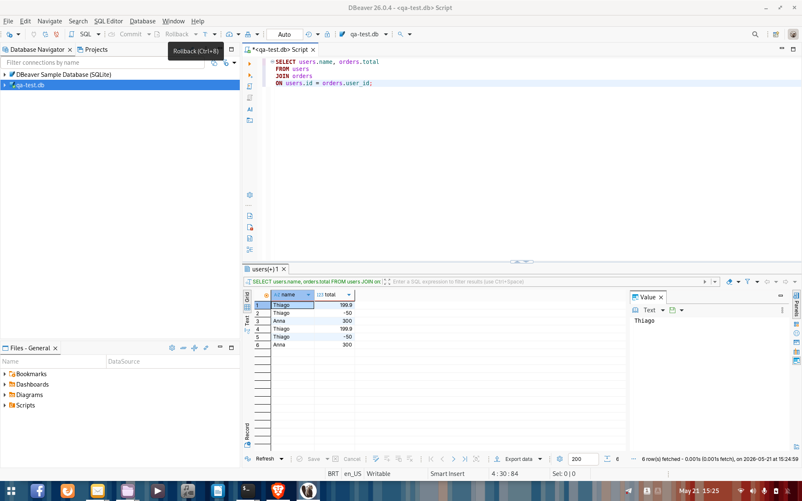
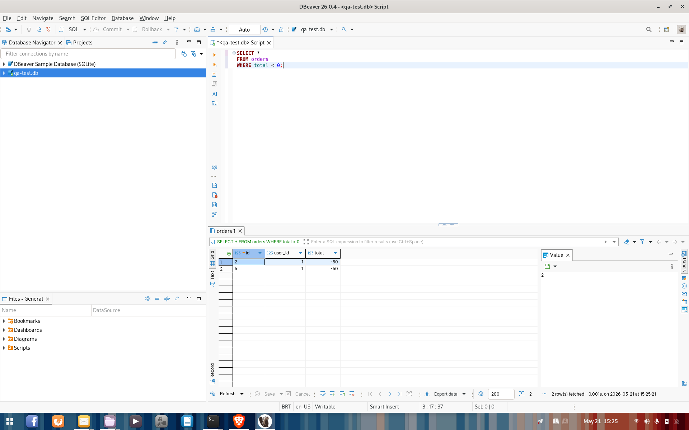
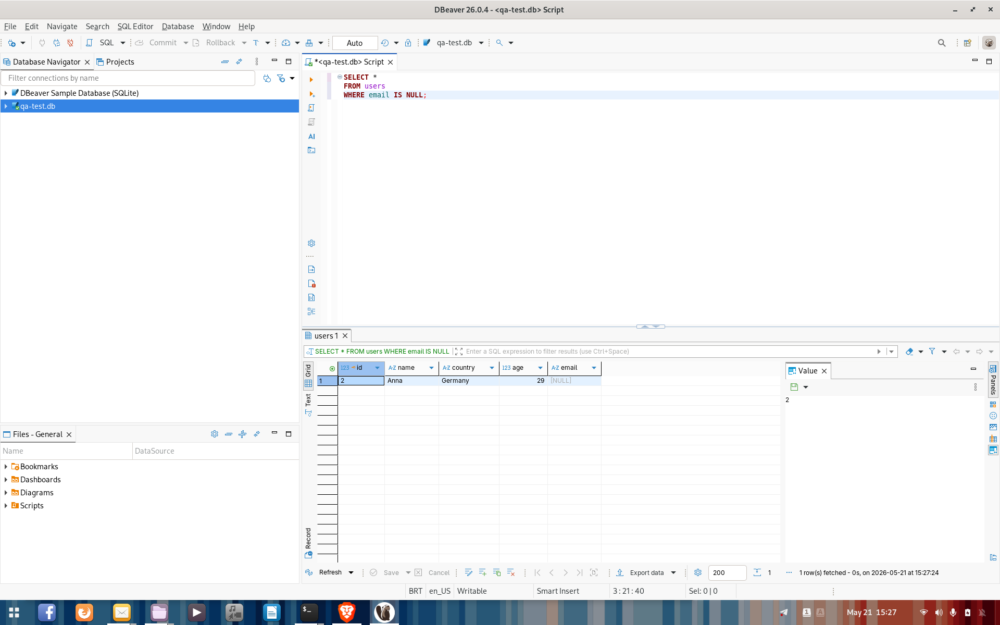

# SQL Investigation for QA

SQL practice project focused on QA investigation, data validation, business rule checks, and relational database analysis.

## Project Objective

The goal of this project is to practice SQL from a Quality Assurance perspective, using queries to investigate data, validate relationships, check business rules, and identify inconsistencies.

## Project Structure

- `queries` → SQL scripts and investigation exercises
- `screenshots` → Query execution evidence
- `docs` → Additional notes and documentation

## Covered Topics

- Basic SELECT queries
- Filtering with WHERE
- Sorting with ORDER BY
- JOIN operations
- Data relationship validation
- Missing data investigation
- Aggregation with COUNT
- Business rule verification

## Skills Demonstrated

- SQL for QA
- Database Validation
- Data Investigation
- Business Rule Testing
- JOIN Analysis
- Backend Data Verification
- QA Analytical Thinking

## Query Files

- `01_basic_queries.sql` → Basic SQL queries
- `02_joins.sql` → JOIN practice
- `03_sample_data.sql` → Sample database data
- `04_sql_investigation_exercises.sql` → QA investigation exercises

## Key Learnings

- Using SQL to support QA investigations
- Validating relationships between tables
- Finding missing or inconsistent data
- Checking business rules through queries
- Thinking beyond the UI by validating backend data

## Query Examples

### Join Investigation

### Negative Order Validation

### QA Data Validation

## Author

Thiago Queiroz Meneses dos Santos
